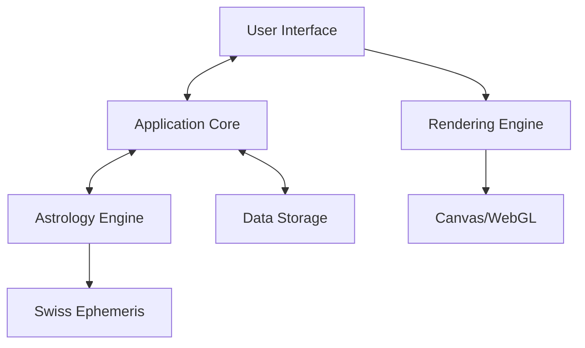

# System Architecture

## High-Level Overview

## Core Components

### 1. Application Core
- **State Management**: Centralized application state
- **Event System**: Handles user interactions and system events
- **Service Layer**: Business logic and service orchestration

### 2. Astrology Engine
- **Planetary Calculations**: Positions, aspects, and transits
- **Chart Generation**: Houses, aspects, and chart patterns
- **Time Zone Handling**: Accurate time and location calculations

### 3. User Interface
- **Component Library**: Reusable UI components
- **Chart Visualization**: Interactive chart rendering
- **Responsive Layout**: Adapts to different screen sizes

### 4. Data Layer
- **Chart Storage**: Save and load birth charts
- **User Preferences**: Application settings and themes
- **Local Storage**: Offline data persistence

## Data Flow

1. **User Interaction**: User inputs birth data
2. **Event Handling**: UI triggers calculation events
3. **Processing**: Astrology engine performs calculations
4. **Rendering**: Results are formatted and displayed
5. **Persistence**: Data is saved if needed

## Performance Considerations
- **WebAssembly Optimization**: Efficient memory usage
- **Rendering Performance**: Optimized for 60fps
- **Background Processing**: Heavy calculations in web workers

## Security
- Input validation
- Secure storage of sensitive data
- Protection against XSS and other web vulnerabilities
