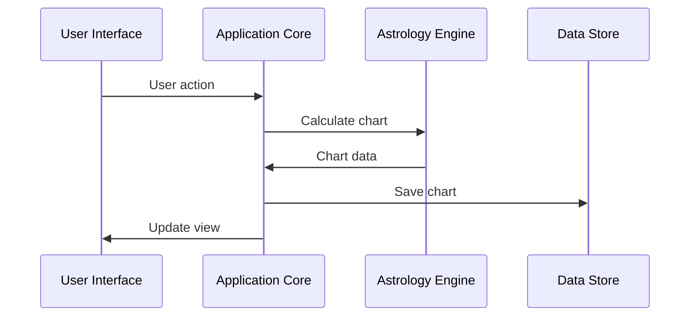

# System Architecture

## Overview

Rust Astrology is built with a modular architecture that separates concerns while maintaining high performance and cross-platform compatibility.

## Core Components

### 1. Application Core (`src/core`)
- **State Management**: Centralized application state using Rust's type system
- **Event System**: Handles user interactions and system events
- **Service Layer**: Business logic and service orchestration

### 2. Astrology Engine (`src/astrology`)
- **Calculations**: Planetary positions, aspects, and house systems
- **Models**: Data structures for charts, planets, and aspects
- **Time Handling**: Timezone and calendar conversions

### 3. User Interface (`src/ui`)
- **Components**: Reusable UI elements
- **Pages**: Application screens
- **Theming**: Support for light/dark modes

### 4. Platform Integration (`src-tauri`)
- **Desktop**: Tauri-specific code
- **File System**: Native file operations
- **System Tray**: Background functionality

## Data Flow

## Cross-Platform Considerations

### Web Target
- WASM binary size optimization
- Asynchronous loading of resources
- Progressive enhancement

### Desktop Target
- Native system integration
- Background processing
- System notifications

## Performance

### Optimization Strategies
- **Memory**: Efficient data structures
- **CPU**: Parallel computations
- **GPU**: WebGL acceleration
- **I/O**: Asynchronous operations

## Security

### Data Protection
- Input validation
- Secure storage
- Encryption for sensitive data

### Web Security
- CSP headers
- XSS protection
- CSRF tokens

## Testing Strategy

### Unit Tests
- Core logic
- Mathematical calculations
- Data transformations

### Integration Tests
- Component interactions
- State management
- API contracts

### E2E Tests
- User workflows
- Cross-browser testing
- Performance benchmarks

## Monitoring and Logging

### Metrics
- Performance metrics
- Error tracking
- Usage analytics

### Logging
- Structured logging
- Different log levels
- Remote logging capability

## Future Considerations

### Scalability
- Web workers for heavy computations
- Service workers for offline support
- Caching strategies

### Extensibility
- Plugin system
- Custom calculation methods
- Theming support
